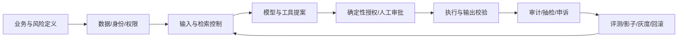

# AI Safety Research Hub · AI 安全研究与应用

面向安全策略、审核产品、数据分析和 Agent 工程的公开研究项目。整理主流大厂的 AI 安全资讯、治理方法、工程工具、业务场景和典型案例，将研究结论转成可实施的控制与评测设计。

**资料核验日期：2026-09-30。** 首批收录 12 家公司、32 条来源、8 个案例、12 类应用场景、16 个脱敏评测设计和 8 条精选动态。内容以中文原创分析为主，引用原始页面，不重新托管厂商文档、模型和攻击题包。

## 快速阅读

- 想了解大厂在做什么：阅读[公司实践对照](docs/company-comparison.md)。
- 想分析典型Case：阅读[案例地图](cases/README.md)。
- 想搭建平台：阅读[安全架构与工作流](docs/architecture.md)。
- 想服务实际业务：阅读[应用场景](docs/scenarios.md)。
- 想做评测和降本：阅读[评测与指标](docs/evaluation.md)和[成本收益](docs/cost-and-value.md)。
- 想准备面试/项目计划：阅读[90天实施路线](docs/roadmap.md)。
- 想查看近期材料：阅读[精选资讯](news/README.md)和[来源索引](sources/README.md)。

## 研究范围

| 层面 | 核心问题 | 主要产出 |
| --- | --- | --- |
| 内容与输出安全 | 是否有害、误杀、幻觉、标识缺失 | 风险标签、证据、分级处置 |
| 模型与能力治理 | 风险能力、发布门禁、残余风险 | 风险评测、模型报告、发布批准 |
| 应用与Agent安全 | 注入、越权、泄密、工具副作用 | 权限、沙箱、审批、出站控制 |
| 数据与隐私 | 跨租户、敏感数据、训练/检索污染 | ACL、脱敏、数据血缘 |
| 运营与人机协同 | 人审、申诉、漂移、成本 | 队列、抽检、回流、效果归因 |

## 大厂覆盖

| 公司 | 主要学习方向 | 专题 |
| --- | --- | --- |
| OpenAI | 输入/输出/工具Guardrail与人工批准 | [阅读](companies/openai.md) |
| Anthropic | 风险治理、分类器与行为评测 | [阅读](companies/anthropic.md) |
| Microsoft | 企业内容安全与AI红队 | [阅读](companies/microsoft.md) |
| Google / DeepMind | 组织基线与模型能力风险 | [阅读](companies/google.md) |
| Meta | 开放安全模型与评测工具 | [阅读](companies/meta.md) |
| Amazon Web Services | 模型解耦的Guardrail服务 | [阅读](companies/aws.md) |
| NVIDIA | 五段式Rails与联合评测 | [阅读](companies/nvidia.md) |
| 阿里巴巴 / 阿里云 | 安全运营Agent与空间隔离 | [阅读](companies/alibaba.md) |
| 字节跳动 / 火山引擎 | 模型入口、认证、配额与可观测 | [阅读](companies/bytedance.md) |
| 腾讯 / 腾讯云 | LLM WAF与路由防护 | [阅读](companies/tencent.md) |
| 百度 / 百度智能云 | 大模型与Agent安全护栏 | [阅读](companies/baidu.md) |
| 快手 / 可灵AI | 内容生态、AIGC标识与商业治理 | [阅读](companies/kuaishou.md) |

公司治理、公开研究、云产品与真实事故具有不同证据性质。每篇专题与Case均说明材料类型和适用边界。评测样例仅为测试设计，没有调用真实厂商接口，也没有生成厂商排名。

## 应用到既有项目

- [SLG游戏数据Agent](https://github.com/HaitaoZhu0511/game-agent-demo)：只读SQL、指标血缘、租户隔离、名单处置授权。
- [AI短剧数据Agent](https://github.com/HaitaoZhu0511/ai-short-drama-data-agent)：剧本/图文/音频安全、素材权利、生成标识、发布门禁。
- [商业化安全审核数据中台](https://github.com/HaitaoZhu0511/commercial-safety-review-data-hub)：政策与模型版本、人审、申诉、风险曝光和商业收益。

## 基础工作流



## 项目结构

```text
companies/     12家公司专题
cases/         8个案例分析与Case地图
catalog/       公司、来源、风险、场景、案例、精选动态JSON
news/          精选资讯与维护约定
sources/       来源索引与证据规则
methodology/   风险治理和威胁建模方法
playbooks/     事故响应、红队与策略发布
contracts/     风险事件JSON Schema
evals/         16个脱敏测试设计，未运行模型
scripts/       资料一致性与链接路径校验
.github/       GitHub Actions资料校验
```

## 验证与维护

Python 3.10+，仅标准库：

```bash
python scripts/validate.py
python -m unittest discover -s tests -v
```

校验JSON、跨目录引用、来源ID、日期、Case类型、必需文件和本地Markdown路径；不进行线上安全扫描、不把结构校验当模型评测。新增资料时按[维护规则](CONTRIBUTING.md)补充来源、性质和核验日期。

校验器另有6个单元测试，覆盖重复ID、未知引用、无效/未来日期、路径越界和正常输入。

后续路线：厂商文档版本快照、授权环境下的真实评测适配、数据Agent权限验证、审核前置业务试点。当前没有定时更新任务，资讯目录按人工核验维护。

## 许可证

本仓库原创分析和示例代码采用 MIT；外部文档、模型、数据集与代码使用各自许可证。尤其 Meta 工具与模型组件的许可不同，部署前按具体版本核对。
