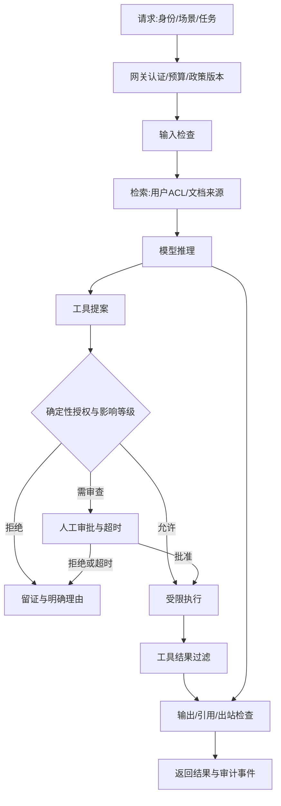

# AI安全平台架构与工作流

## 三条工作流

### 在线请求

用户消息、外部文档和工具结果保留来源属性。任何自然语言检测结果都不能修改用户权限。网关身份不应使用一个拥有全部数据的服务账号替代实际用户。

### 策略发布

政策定义 → 候选Prompt/规则/模型 → 留出评测 → 影子差异 → 人工批准 → 小流量灰度 → 全量 → 持续监控 → 回滚。

每次改变模型、检索源、工具配置、权限、阈值或系统提示都可能改变安全表现，需绑定发布版本。候选策略不得用其调优集证明线上收益。

### 人机复盘

机审信号 → 低置信/高影响人工队列 → 专家校验 → 执行 → 申诉独立复核 → 根因 → 样本准入 → 新版本评测。

## 七个组件

| 组件 | 接口与责任 |
| --- | --- |
| 身份/数据权限 | 调用者、租户、库表、字段、操作范围 |
| 政策控制 | 场景、基线、模板、版本、生效时间 |
| 检测服务 | 内容、注入、隐私、幻觉等信号 |
| 决策编排 | 信号与政策组合，不把模型分数直接写成处罚 |
| 工具执行 | 参数、目的地、金额、审批、幂等与回执 |
| 人审与申诉 | 技能组、证据、时限、复核与恢复 |
| 观测与评测 | 版本、Trace、指标、事件、回归和成本 |

## 失败与降级

检测超时：低影响读任务可进入有记录的受限模式；高影响写任务停在审批或人工队列。权限服务不可用：敏感操作拒绝执行。输出过滤失败：暂停外发，不能因失败返回未检查的敏感内容。重试必须有预算与截止时间。

流式输出应特别检查敏感内容是否在最终检测前已发出；缓存必须按租户、权限、模型和策略版本隔离，权限或政策变化后失效。

## 日志设计

保存事件ID、身份引用、来源、政策/模型/工具版本、风险信号、决定、审批、执行回执、延迟和成本。原始敏感文本使用受控证据引用；分析看板不能自动获得全部内容读取权限。

事件契约见[Schema](../contracts/risk-event.schema.json)。0.3区分请求者、事件操作人和原审批人；升级时按[迁移约定](control-hardening.md)保留历史证据。架构是本项目建议，不对应任何一家公司的未公开系统。

从演示到实际业务的持久账本、累计预算、数据库权限、素材血缘与人审验收，见[生产接入路线](production-integration.md)。这些组件尚未在本仓库实现。
