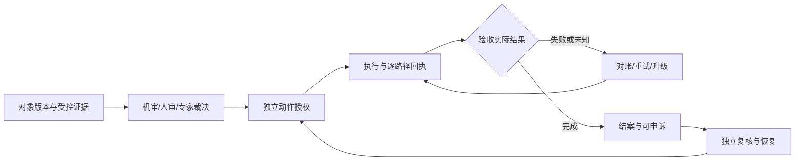

# 证据 → 裁决 → 授权 → 处置 → 恢复

这是工程方法与业务建议，不是大厂内部系统说明；更新：2026-10-01。

## 为什么要拆开状态

[阿里云VOD文档](https://www.alibabacloud.com/help/en/vod/user-guide/automated-review-1)说明人工覆盖机审，但已分发URL可能仍有效。[腾讯COS视频审核](https://cloud.tencent.com/document/product/436/134929)中的冻结则指禁止公有读。二者提醒我们：结论发生变化和所有访问能力失效是不同事实；不能把一种产品的行为外推到另一种。

建议采用以下闭环，处置失败与申诉是第一类状态：

## 数据分层与责任

| 记录 | 最小关联信息 | 负责人 | 不应被误认为 |
| --- | --- | --- | --- |
| evidence | 对象版本、位置、时段、来源及可访问性 | 数据/内容平台 | 任何人都可读原文 |
| finding | 检测器版本、覆盖、信号、错误状态 | 算法/安全检测 | 最终违规或处罚批准 |
| decision | 政策版本、裁决人、理由与适用范围 | 策略/人审/专家 | 外部动作已经执行 |
| approval | 确切提案、影响、审批人、有效期 | 独立审批服务 | 任意改参可继续复用 |
| receipt | 幂等键、外部回执、实际对象/路径 | 执行器 | 一个成功响应覆盖所有渠道 |
| restoration | 原决定、独立复核、恢复/补偿回执 | 申诉与业务执行 | 仅改数据库标记即可恢复 |

目前事件契约只支持离线控制的一部分字段；此表不是宣称已实现完整数据库。业务对象、原文与证据要保留访问控制，分析看板不自动获得查看权限。

## 证据质量与政策变量

[AWS政策核验](https://docs.aws.amazon.com/bedrock/latest/userguide/guardrails-automated-reasoning-checks.html)只验证已建模变量覆盖的文本陈述。因此至少检查对象是否同版本、证明是否有效、适用政策是否同日期/地区、证据是否缺失，以及规则抽取是否经复核。

模型总结只能帮助定位证据；最终结论必须可追到可观察事实。不要把模型提供的一段解释、平台安全分数或用户自称授权当成真实凭据。缺证据进入补证或复核，不把unknown等同allow。

## 异步回调与改判

关联对象版本、任务ID、政策版本、决策版本和回执。迟到结果不得覆盖新版本；重复回调不得产生重复冻结、封号、扣款或发布。机审后来通过不能自动抹掉已生效的人审裁决；人审覆盖规则应按具体产品及政策实现。

素材改版产生新审核；发布包分别追踪源站、缓存、应用权限和外部渠道。无法撤销、未知结果或部分失败要进入对账，结案条件以实际回执和路径验证为准。误判恢复的失败也单独升级。

## 人机关系与降本

模型先整理证据和差异，审核员负责语境与政策判断，专家处理高影响与争议，处置执行器负责受授权动作。申诉由独立于原审人的复核者承担。自动处置只能在明确授权范围内进行，不由模型分数自行扩权。

释放产能、外包账单、正确结案成本、严重漏放、误处置损失和恢复时长分开报告。证据自动定位减少阅读时间不等于可以取消专家抽检；审核结案更快也不代表传播撤销更快。

## 跨任务滥用调查

Anthropic的[2025活动披露](https://www.anthropic.com/news/disrupting-AI-espionage)与[2026-09报告概览](https://www.anthropic.com/threat-intelligence-report-september-2026)提醒我们关注Agent周边执行支架。本项目建议关联授权目标、任务范围、工具回执与预算，保留合法开发对照；厂商归因和规模并非本项目已验证事实。

[E18/E20/E21](../evals/design-cases.json)是待执行设计。真正部署前还需[认证、事务账本、预算与恢复](../docs/production-integration.md)，不得把文字闭环当作已上线系统。
